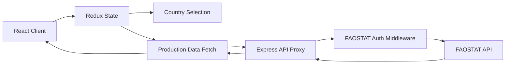

# Arabica Coffee Dashboard – Technical Documentation

## Project Description

Arabica Coffee Dashboard is the first version of a broader coffee analytics platform and works as the foundational MVP for a larger dashboard ecosystem. This initial release focuses on a single, critical use case: visualizing Arabica coffee production trends across several countries using official data from FAOSTAT.

Although it is intentionally limited in scope, this project represents the architectural and technical base on which the rest of the dashboard will be built. It establishes the core patterns for API integration, secure data access, state management, frontend rendering, and validation logic that will be expanded in future iterations.

At this stage, the application demonstrates a working full-stack flow: the frontend renders an interactive dashboard, the backend authenticates to an external dataset provider, and the data is normalized and displayed in a structured way. The project is therefore best understood as a version 1.0 foundation and a working proof of concept rather than a final, complete product.

---

## Goals

The primary goal of this project is to establish the technical foundation for a larger coffee dashboard initiative while delivering a working first release with real data and functional interactions.

This version is intentionally positioned as a WIP / v1.0 and aims to:

- Validate the overall product idea through a working dashboard prototype.
- Prove that the application can securely consume real-world agricultural data from FAOSTAT.
- Establish a stable architecture for future dashboard modules, filters, analytics, and reporting features.
- Introduce Redux Toolkit as the state management foundation for the upcoming product expansion.
- Create a backend pattern for token handling, external API mediation, and data normalization.
- Build a solid frontend shell that can later evolve into a richer multi-view analytics system.
- Put in place an automated quality gate through GitHub Actions so client, server, and end-to-end tests run on push and pull request events.
- Demonstrate good engineering practices in a small but scalable project structure.

---

## Problematics

### 1. Direct access to external data is restricted
The FAOSTAT API requires authentication and does not allow the client application to use credentials directly in the browser. If the frontend tried to call the service directly, it would expose credentials, create insecure access patterns, and violate the API's intended usage model.

### 2. External data is not delivered in a frontend-ready format
The FAOSTAT payload contains multiple fields and metadata that are not necessary for the chart. The application needs only a subset of values such as the year and the production figure, making it necessary to transform the response before rendering it.

### 3. Users need a comparative, interactive experience
A static chart would not be enough for a dashboard. The application must allow the user to switch countries and immediately see production trends change across time, without a full page refresh.

### 4. Data access must be resilient and maintainable
The backend must handle authentication, token expiration, and API errors gracefully. This is especially important when dealing with third-party systems that require periodic token renewal.

### 5. UI state needs to remain predictable
When a country is selected, the chart data and UI state should update consistently. Without structured state management, the application would become harder to scale and harder to test.

---

## How I'm Addressing Each Problematic

### 1. Securing external API access
The project introduces a dedicated Express backend acting as a proxy between the frontend and FAOSTAT. The client never calls the FAOSTAT service directly. Instead, the server authenticates with a login endpoint and stores the access token locally.

This approach reduces frontend exposure and centralizes credentials, making the solution safer and more production-friendly.

### 2. Normalizing external responses
The backend controller filters the raw FAOSTAT response and maps it into a simplified object structure with only the fields required by the dashboard:

- year
- value

This keeps the frontend lighter and ensures the chart receives a clean data model that is easy to visualize and validate.

### 3. Enabling interactive country selection
The frontend uses Redux Toolkit slices to manage global state. The selected country is stored centrally and connected to the chart data fetch flow. When a user clicks a country, the application dispatches an action to update the selected value and trigger a new API request.

This keeps behavior predictable and allows the dashboard to react instantly to user interaction.

### 4. Handling token lifecycle and API errors
The authentication middleware checks whether the token is missing or close to expiration before each request. If the token is expired or invalid, it logs in again and renews the cached value.

The backend also catches and formats errors from the external API, returning controlled responses to the frontend instead of leaking raw upstream failures.

### 5. Improving maintainability and testability
Redux slices and typed hooks make the state architecture explicit and reusable. Separate folders for features, components, and controllers keep responsibilities clear.

The project also includes unit and integration tests code coverage for frontend and backend behaviors, which helps validate the app as it evolves.

---

## Architecture

The application follows a simple but effective layered architecture:



### Frontend layer
The client is built with React + TypeScript and Vite. It renders the dashboard, handles user interactions, and uses Redux Toolkit to manage UI state.

### Backend layer
The Express server exposes a controlled API route for production data. It is responsible for authentication, proxying the FAOSTAT request, and transforming the upstream response.

### Data flow
1. The user selects a country from the dashboard.
2. Redux dispatches the selected country into the state.
3. The frontend requests the production data for that country from the API backend.
4. The backend validates or refreshes the FAOSTAT token.
5. The backend fetches the relevant production values from FAOSTAT.
6. The response is normalized and sent back to the frontend.
7. The chart updates based on the returned production data.

The project also includes a CI layer built with GitHub Actions. Every push and pull request triggers automated validation for the client, server, and end-to-end test suites, which helps maintain stability as the product grows and gives the dashboard a repeatable quality baseline.

---

## Tools, Technologies and Protocols

### Frontend
- React 19
- TypeScript
- Vite
- Redux Toolkit
- Mantine UI library
- Mantine Charts / Recharts
- React Simple Maps

### Backend
- Node.js
- Express 5
- TypeScript
- CORS middleware
- Native fetch for API communication

### Testing and automation
- Vitest
- Testing Library
- Jest
- Supertest
- Playwright
- GitHub Actions for CI validation on push and pull request events

### Protocols and communication standards
- HTTP/HTTPS for client-server communication
- REST-style API endpoints
- Bearer token authentication for FAOSTAT access
- Form-encoded login request to the FAOSTAT auth endpoint
- CORS enabled for frontend-backend interoperability

### Security considerations
- Credentials are stored in environment variables, not in the frontend bundle.
- External API access is mediated by the backend proxy.
- Token refresh is handled server-side to avoid stale or invalid authentication.

---

## Project Structure

```text
arabica-coffee-dashboard/
├── client/
│   ├── src/
│   │   ├── components/
│   │   │   ├── Graph.tsx
│   │   │   └── WorldMap.tsx
│   │   ├── features/
│   │   │   ├── country/
│   │   │   │   ├── CountryProd.tsx
│   │   │   │   ├── CountrySelect.tsx
│   │   │   │   └── countrySlice.ts
│   │   │   └── production/
│   │   │       ├── ProductionGraphic.tsx
│   │   │       └── productionSlice.ts
│   │   ├── hooks/
│   │   │   └── index.ts
│   │   ├── App.tsx
│   │   ├── index.css
│   │   ├── main.tsx
│   │   └── store.ts
│   ├── tests/
│   │   ├── setup.ts
│   │   └── ui.test.tsx
│   ├── package.json
│   ├── vite.config.ts
│   └── README.md
│
├── server/
│   ├── src/
│   │   ├── controllers/
│   │   │   └── productionController.ts
│   │   ├── middleware/
│   │   │   └── authManager.ts
│   │   ├── routes/
│   │   │   └── productionRoute.ts
│   │   ├── types/
│   │   │   └── faostatTypes.ts
│   │   ├── utils/
│   │   │   ├── AppError.ts
│   │   │   └── response.ts
│   │   ├── app.ts
│   │   └── index.ts
│   ├── tests/
│   │   ├── auth.test.ts
│   │   ├── countryProd.test.ts
│   │   ├── helpers/
│   │   │   └── testHelpers.ts
│   │   └── types/
│   │       └── testTypes.ts
│   ├── package.json
│   └── tsconfig.json
│
├── e2e/
│   ├── dashboard.spec.ts
│   ├── package.json
│   └── playwright.config.ts
│
├── README.md
├── TECHNICAL_DOC.md
├── package.json
└── .gitignore
```

### Architectural interpretation of the structure
- The client folder contains all visualization and interaction logic.
- The server folder contains the secure backend integration and data filtering logic.
- The e2e folder validates the app behavior from the user perspective.
- The root package acts as a test orchestrator for the sub-projects.

---

## Final Portfolio Summary

Arabica Coffee Dashboard is a focused full-stack project that demonstrates how to build a modern data visualization application using secure API integration, state management, and clean architecture. It combines real-world data from FAOSTAT with a user-friendly dashboard experience, while also reflecting good engineering decisions around authentication, backend separation, and test coverage.

This project is particularly valuable for a portfolio because it showcases practical experience with:

- full-stack application design
- React and TypeScript development
- Redux state management
- secure backend API proxying
- data cleaning and normalization
- third-party API integration
- automated validation through GitHub Actions CI
- testing across frontend, backend, and E2E levels
